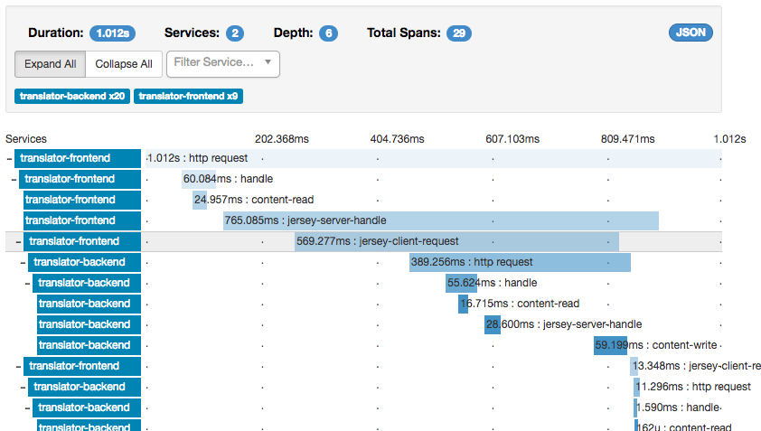

# Configuring Zipkin

Helidon is integrated with the Zipkin tracer.

The Zipkin builder is loaded through `ServiceLoader` and configured. You could also use the Zipkin builder directly, though this would create a source-code dependency on the Zipkin tracer.

## Maven Coordinates

To enable Zipkin Tracing, add the following dependency to your project’s `pom.xml` (see [Managing Dependencies](../../about/managing-dependencies.md)).

``` xml
<dependency>
    <groupId>io.helidon.tracing.providers</groupId>
    <artifactId>helidon-tracing-providers-zipkin</artifactId>
</dependency>
```

## Configuring Zipkin

## Configuration options

| Key | Kind | Type | Default Value | Description |
|----|----|----|----|----|
| <span id="a3dd17-api-version"></span> [`api-version`](../../config/io_helidon_tracing_providers_zipkin_ZipkinTracerBuilder_Version.md) | `VALUE` | `i.h.t.p.z.Z.Version` | `V2` | Version of Zipkin API to use |

The following is an example of a Zipkin configuration, specified in the YAML format.

``` yaml
tracing:
  zipkin:
    service: "helidon-service"
    protocol: "https"
    host: "zipkin"
    port: 9987
    api-version: 1
    # this is the default path for API version 2
    path: "/api/v2/spans"
    tags:
      tag1: "tag1-value"
      tag2: "tag2-value"
    boolean-tags:
      tag3: true
      tag4: false
    int-tags:
      tag5: 145
      tag6: 741
```

Example of Zipkin trace:

<figure>

</figure>
